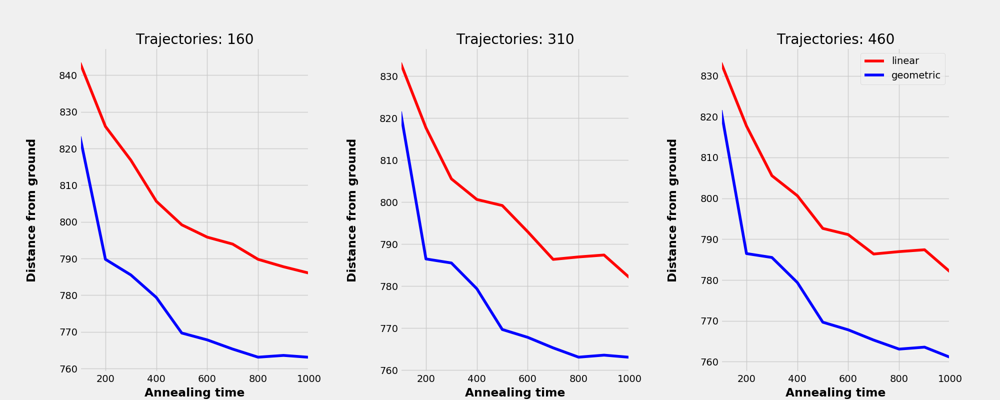
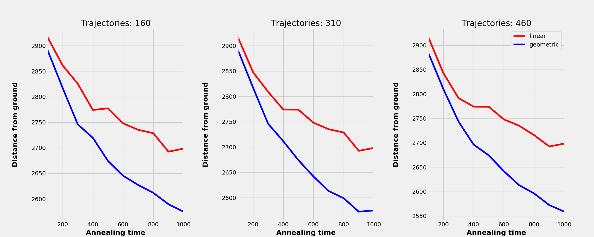
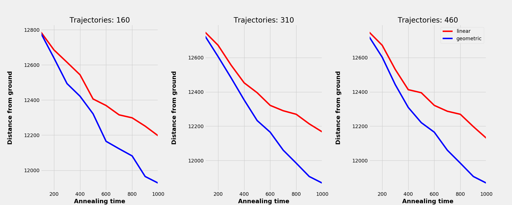

# Performance tests of simulated annealing

It is well established that annealing-based spin-glass solvers can
"stuck" in local minimum, ultimately preventing the heuristic from
reaching the ground state (_i.e._, true optimal solution). This, in
fact, remains true for all heuristic approaches designed for
optimization. Therefore, it is essential to perform testing, and
benchmarking against problem instances that are considered to be "hard"
(_e.g._, have a nontrivial structure). Herein, we investigate how
well the oneSolver performs trying to solve droplets instances encoded
in two-dimensional Ising spin-glass problems. Similar idea has recently
been incorporated to test sophisticated solvers, which are based on
tensor networks, and and projected entangled pair states.

Difference between the true ground state, and the solution found by
oneSolver for the Chimera graph with L=128 vertices, and various
repetitions. "linear", and "geometric" reefer to the possible schedules
of the inverse Boltzmann temperature, $\beta$, that is used in the
Metropolis-Hastings update.

As above, for the Chimera graph with L=512
vertices.

As above, for the Chimera graph with L=2048
vertices.

## Conclusions

For details concerning droplet instances cf. M. M. Rams, M. Mohseni, B.
Gardas, "*Heuristic optimization and sampling with tensor networks for
quasi-2D spin glass problems*", [arxiv.org/abs/1811.06518
(2018)](https://arxiv.org/abs/1811.06518). Further details, including
additional testing problems with known solutions, can also be found at
<https://github.com/marekrams/tnac4o>.

As can been seen in figures, the difference between the true ground state
(obtained by the tensor network solver), and the solution found by
oneSolver increases with the increasing system size (number of
vertices). This behaviour was to be expected as the problem is NP-hard.
Moreover, the geometric inverse temperature schedule, performed better
than the linear one. Nevertheless, oneSolver was unable to find the
correct ground state in *any* of the considered cases.

That being said, the issue is not with the implementation (which is
efficient) but rather with the algorithm itself, which in a way is too
simplistic to capture sophisticated interactions between spins encoded
in the droplet instances.

## Recommendation

Based on the performed benchmarks, it is therefore recommended to
implement solvers that incorporate more clever spin updates. A good
starting point in this context would be the population annealing, and
parallel tempering. More sophisticated approaches that could also be
incorporated are based on tensor networks, tropical algebras, and
Lagrange multipliers.
