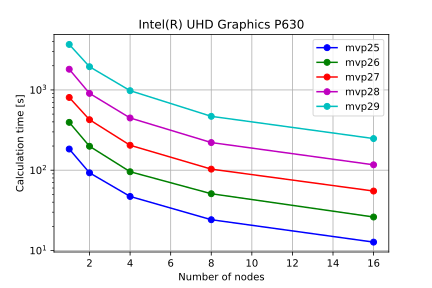

# Testing exhaustive search on GPU

The speed of computation of the exhaustive search one Intel DevCloud  
nodes is presented on the below figure. On this figure the speed of computation
against nodes is depicted.

# Testing exhaustive search on CPU

The speed of computation on the available processors is presented on the
figure below.

