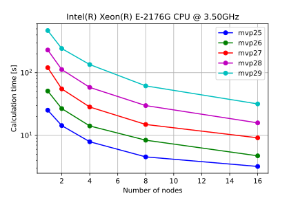
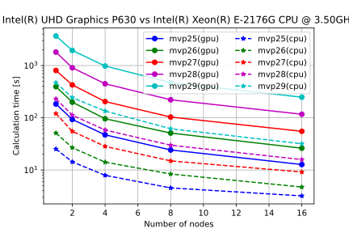

# 1. Introduction 
Optimization problems are often encountered in the field of research and they generally hard. The hardness of the problem is due to the exponential worst-case runtime required to explore the extensive solution space for the solution. Many such optimization problems can be expressed in terms of the binary-variable model with a quadratic cost function. Such a class of problems is referred to as Quadratic Unconstrained Binary Optimization (QUBO). A few NP-Hard problems can naturally be reduced to QUBO and are central to the theory of computational complexity. The QUBO model applies to a diverse set of tasks such as resource allocation, clustering, set partitioning, facility locations, various forms of assignment problems, sequencing problems, and ordering problems [\cite]. The QUBO problem can be expressed as a physics spin-glass model, which can be encoded as an Ising Model describing spins with 2-body interaction [\cite].

QUBO represents an optimization problem, where a quadratic function on $N$ binary variables is to be minimized over $2^N$ possible assignments of its variables. The problem can also be represented as an undirected graph $G = [N,E]$ with node set $N = \{1,2,\cdots,i,\cdots,n\}$ and edge set $E = \{(i,j): i,j \in N \}$. The QUBO optimization problem can be expressed as:

$\min_{\vec{x}} \biggl\{E_{qubo}(\vec{x}) = -\sum_{i=0}^{i=n} c_{ii}x_{i} - \sum_{i=j=0}^{i=j=n} c_{i,j} x_{i}x_{j}\biggr\}$

where the function $E_{qubo}$ is reffered to as the cost function, $c_{i,j}$ as the weight of the edge $(i,j)$ and $\vec{x} = (x_{1},x_{2},\cdots,x_{n})$ represents the assgnments of $N$ boolean variables that maximinimizes the cost function.

An equivalent formulation where coefficients are represented as a Q matrix is: 

$\min\biggl\{-x^tQx: x \in \{0,1\}^n\biggr\}$

where $Q$ is an n-by n upper triangular matrix of coefficients.

# 2. Introduction to parallel and distributed Ising models solvers
Several algorithms have been developed over a period of time to solve QUBO instances ranging from exact exhaustive solvers to approximate solvers, to heuristics without performance guarantee [\cite]. Recently quantum algorithms have also joined the race. Here we will describe the two solvers: exhaustive search and annealing. The exhaustive algorithm gives the exact result for a small size problem and it is used to benchmark other algorithms and the annealing algorithm is a stochastic method to solve the problem.

## Exhaustive Search
The idea of an exhaustive brute force solver is to search the entire state space for a low energy configuration of state variables. In physics, the above formulation of the QUBO problem is equivalent to the Hamiltonian formulation of an Ising Model describing spins with 2-body interaction; it represents the Hamiltonian of the system. Since the terms are classical and they commute hence this is equivalent to the exact diagonalization. Although the eigenvalue problem for classical models can be executed in parallel, an efficient implementation is not trivial.

Exhaustive solvers are limited to small problem sizes, and they can solve the Ising model defined on an arbitrary graph. With the exhaustive search algorithm, one can certify the output on small problem size. On large problem size, the exhaustive search algorithm requires computing resources exponential with the size of the graph.

## Simulated annealing
Simulated annealing is a randomized search method for optimization problems and it is inspired by Statistical mechanics. It obtains its name from the heating-cooling methodology of metal annealing. This Monte Carlo search method tries to improve a solution by walking randomly in the space of possible solutions and each move is probabilistically dependent on a parameter called "temperature". At high temperature, the random walk is unbiased and the moves are uniformly distributed over the whole space of solutions; as the temperature decreases, each move of random walk lead towards more likely solutions with a better objective value, and the distribution is more and more biased towards the optimal solution. The sequence of temperatures and lengths of time for which they are maintained is called *annealing schedule*.

## Parallel and distributed solver for Ising models
Parallel Ising model solvers on a single node with multiple processing units solve a task in parallel by breaking the problem into small pieces and assign each subtask to each process. In the particular case of exhaustive search, the solution state space is divided into equal chunks and provided to each process as an initial parameter. Whereas in the case of Simulated annealing, each process searches the state space for a solution starting from a randomly generated state.

Distributed solvers solve the tasks on multiple nodes with multiple processing units by breaking the problem into small pieces and assign each subtask to each process. The processes are spread across multiple nodes on the network. In the particular case of exhaustive search, the solution state space is divided into equal chunks. These subspaces are then assigned to each process as an initial parameter using the MPI library. The result of the computation is then gathered from each process to compute the final solution. Whereas, in the case of Simulated annealing, each process searches the state space for a solution starting from a randomly generated state. The main process provides a unique seed to all other processes to generate a unique starting space using the MPI library. The result of the computation is then gathered from each process to compute the final solution. 


# 3. An introduction to oneSolver 1.0
One solver 1.0 is a parallel implementation of Exhaustive Search and Simulated annealing algorithms that uses oneAPI Data Parallel C++ (DPC++) to define data-parallel functions and offload them to devices using The Khronos Group SYCL runtime API. The oneSolever 1.0 can execute on device accelerators such as CPU, GUP, etc.

The Exhaustive Search version of one solver 1.0 implements the following algorithm:

```{r, eval=FALSE}
Inputs: Graph G of size n as a file, device type
Outputs: Lowest Energy and Graph G* of size n as file

1. Read_G_to_QUBOModel // read graph to an internal QUBOModel format
2. Select_device // select the specified device (cpu, gpu, host)
3. num_threads = get_compute_units_for_selected_device
4. states_per_thread = n_states / num_threads; // divide the search space 
5. for id < num_thrads do
      local_start_state = assing_local_start_state()
      local_end_state = assing_local_end_state()
6. call_parallel_for id < num_threads do
      local_best_energy = 0
      local_state_best = 0
      for state = local_start_state to local_end_state do
          energy = calculate_energy(state, QUBOModel)
          if energy < local_best_energy
             local_best_energy = energy
             local_state_best = state
7. select_lowest_energy_and_state(local_best_energy,local_state_best )
8. save_lowest_energy_and_state_to_file
```

The Simulated annealing version of one solver 1.0  implements the following algorithm:
```{r, eval=FALSE}
Inputs: Graph G of size n as a file, device type, beta_min, beta_max, schedule (geometric/linear), num_iter, num-tries
Outputs: Lowest Energy and Graph G* of size n as file

1. Read_G_to_QUBOModel // read graph to an internal QUBOModel format
2. Select_device // select the specified device (cpu, gpu, host)
3. if schedule_type == geometric
      shedule = prepare_geometric_schedule(beta_min, beta_max, num_iter)
    else if schedule_type == geometric
      shedule = prepare_linear_schedule(beta_min, beta_max, num_iter)
3. num_threads = get_compute_units_for_selected_device
4. for idx < num_threads do
      schedule = assign_schedule
5. call_parallel_for id < num-tries do
      engine = create_philox4x32x10_engine(seed, id)
      random = random_number_generator(engine)
      local_best_state = local_current_state = random_state_generate(random)
      local_best_energy = calculate_energy(local_start_state, QUBOModel)
      
      for iter = 0 to num_iter do
          beta_schedule = schedule[iter]
          local_current_state = flip_radom_bit_in_current_state(random) 
          energy = calculate_energy(local_current_state, QUBOModel)
          if energy < local_best_energy
             local_best_energy = energy
             local_state_best = local_current_state
6. select_lowest_energy_and_state(local_best_energy,local_state_best)
7. save_lowest_energy_and_state_to_file
```
## An introduction to oneSolver 2.0
The oneSolver 2.0 adapts the exhaustive search and annealing to a distributed 
environment using MPI, oneApi, and Boost C++ library. For exhaustive search, 
the solution space is first divided at node scale and then again at the device 
scale to take the advantage of dissimilar hardware using MPI and SYCL runtime API. 
In annealing, the qubo problem along with a unique seed is distributed to every 
node and then at each node, the problem is distributed over the selected device 
(CPU, GPU, host) to effectively increase the number of trajectories and thus 
effectively increasing the accuracy of the searched solution.

# 4. Performance differences between oneSolver 1.0 and oneSolver 2.0 

The figure shows the performance comparison of distributed exhaustive search on 
a single node (equivalent to parallel implementation) to distributed exhaustive 
search on multiple nodes. The performance tests were executed on the Intel(R) 
DevCloud cluster nodes with CPU device type: Intel(R) Core(TM) i7-8750H CPU @ 2.20GHz 
processor, and the Linux time utility was used to report the results. 


The figure shows the performance comparison of distributed exhaustive search on 
a single node (equivalent to parallel implementation) to distributed exhaustive 
search on multiple nodes. The performance tests were executed on the Intel(R) 
DevCloud cluster nodes with gpu device type: Intel(R) UHD Graphics P630, and 
the Linux time utility was used to report the results.

# 5. Description of running oneSolver 2.0 on a cluster
The oneSolver 2.0 can either be executed on the Intel(R) DevCloud or on any cluster.
To run oneSolver 2.0 on a cluster see the *[notes and the supporting scripts](oneSolver/utils/devcloud)*.

# 6. Additional performance tests.
## Performance comparison of Distributed Exhaustive Search: GPU VS CPU.


The figure shows the performance comparison of exhaustive search algorithm on two 
devices: GPU and CPU of Intel(R) DevCloud cluster for graphs of size L = {25,26,27,28,29} 
vertices on cluster nodes ranging from two to sixteen.

## Performance comparision of Parallel and distributed simulated annealing on CPU vs GPU.