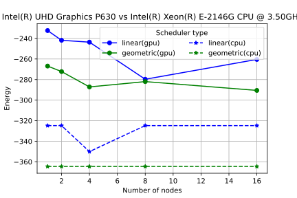

# oneSolver 2.0

## 1. Introduction

Optimization problems are often encountered in the field of research and
they generally hard. The hardness of the problem is due to the
exponential worst-case runtime required to explore the extensive
solution space for the solution. Many such optimization problems can be
expressed in terms of the binary-variable model with a quadratic cost
function. Such a class of problems is referred to as Quadratic
Unconstrained Binary Optimization (QUBO). A few NP-Hard problems can
naturally be reduced to QUBO and are central to the theory of
computational complexity. The QUBO model applies to a diverse set of
tasks such as resource allocation, clustering, set partitioning,
facility locations, various forms of assignment problems, sequencing
problems, and ordering problems [1,2]. The QUBO problem can be
expressed as a physics spin-glass model, which can be encoded as an
Ising Model describing spins with 2-body interaction [3].

QUBO represents an optimization problem, where a quadratic function on
N binary variables is to be minimized over 2^N possible assignments
of its variables. The problem can also be represented as an undirected
graph G = [N, E] with node set N = {1,2,...,i,...,n} and edge
set E = {(i,j): i,j ∈ N}. The QUBO optimization problem can be
expressed as:

where the function F is reffered to as the cost function,
cᵢⱼ as the weight of the edge (i,j) and x = 
(x1, x2, ... , xn) represents the assgnments of N boolean
variables that minimizes the cost function.

An equivalent formulation where coefficients are represented as a Q
matrix is:

where Q is an n-by n upper triangular matrix of coefficients.

## 2. Introduction to parallel and distributed Ising models solvers

Several algorithms have been developed over a period of time to solve
QUBO instances ranging from exact exhaustive solvers to approximate
solvers, to heuristics without performance guarantee [4]. Recently
quantum algorithms have also joined the race. Here we will describe the
two solvers: exhaustive search and annealing. The exhaustive algorithm
gives the exact result for a small size problem and it is used to
benchmark other algorithms and the annealing algorithm is a stochastic
method to solve the problem.

### Exhaustive Search

The idea of an exhaustive brute force solver is to search the entire
state space for a low energy configuration of state variables. In
physics, the above formulation of the QUBO problem is equivalent to the
Hamiltonian formulation of an Ising Model describing spins with 2-body
interaction; it represents the Hamiltonian of the system. Since the
terms are classical and they commute hence this is equivalent to the
exact diagonalization. Although the eigenvalue problem for classical
models can be executed in parallel, an efficient implementation is not
trivial.

Exhaustive solvers are limited to small problem sizes, and they can
solve the Ising model defined on an arbitrary graph. With the exhaustive
search algorithm, one can certify the output on small problem size. On
large problem size, the exhaustive search algorithm requires computing
resources exponential with the size of the graph.

### Simulated annealing

Simulated annealing is a randomized search method for optimization
problems and it is inspired by Statistical mechanics [5]. It obtains its
name from the heating-cooling methodology of metal annealing. This Monte
Carlo search method tries to improve a solution by walking randomly in
the space of possible solutions and each move is probabilistically
dependent on a parameter called "temperature". At high temperature, the
random walk is unbiased and the moves are uniformly distributed over the
whole space of solutions; as the temperature decreases, each move of
random walk lead towards more likely solutions with a better objective
value, and the distribution is more and more biased towards the optimal
solution. The sequence of temperatures and lengths of time for which
they are maintained is called *annealing schedule*.

### Parallel and distributed solver for Ising models

Parallel Ising model solvers on a single node with multiple processing
units solve a task in parallel by breaking the problem into small pieces
and assign each subtask to each process. In the particular case of
exhaustive search, the solution state space is divided into equal chunks
and provided to each process as an initial parameter. Whereas in the
case of Simulated annealing, each process searches the state space for a
solution starting from a randomly generated state.

Distributed solvers solve the tasks on multiple nodes with multiple
processing units by breaking the problem into small pieces and assign
each subtask to each process. The processes are spread across multiple
nodes on the network. In the particular case of exhaustive search, the
solution state space is divided into equal chunks. These subspaces are
then assigned to each process as an initial parameter using the MPI
library. The result of the computation is then gathered from each
process to compute the final solution. Whereas, in the case of Simulated
annealing, each process searches the state space for a solution starting
from a randomly generated state. The main process provides a unique seed
to all other processes to generate a unique starting space using the MPI
library. The result of the computation is then gathered from each
process to compute the final solution.

## 3. An introduction to oneSolver 1.0

One solver 1.0 is a parallel implementation of Exhaustive Search and
Simulated annealing algorithms that uses oneAPI Data Parallel C++
(DPC++) to define data-parallel functions and offload them to devices
using The Khronos Group SYCL runtime API. The oneSolever 1.0 can execute
on device accelerators such as CPU, GUP, etc.

The Exhaustive Search version of one solver 1.0 implements the following
algorithm:

     Inputs: Graph G of size n as a file, device type
     Outputs: Lowest Energy and Graph G* of size n as file

     1. Read_G_to_QUBOModel // read graph to an internal QUBOModel format
     2. Select_device // select the specified device (cpu, gpu, host)
     3. num_threads = get_compute_units_for_selected_device
     4. states_per_thread = n_states / num_threads // divide the search space 
     5. for id < num_thrads do
          local_start_state = assing_local_start_state()
          local_end_state = assing_local_end_state()
     6. call_parallel_for id < num_threads do
          local_best_energy = 0
          local_state_best = 0
          for state = local_start_state < local_end_state do
               energy = calculate_energy(state, QUBOModel)
               if energy < local_best_energy
               local_best_energy = energy
               local_state_best = state
               state = state + 1
     7. select_lowest_energy_and_state(local_best_energy,local_state_best )
     8. save_lowest_energy_and_state_to_file

The Simulated annealing version of one solver 1.0 implements the
following algorithm:

     Inputs: Graph G of size n as a file, device type, beta_min, 
     beta_max, schedule (geometric/linear), num_iter, num-tries
     Outputs: Lowest Energy and Graph G* of size n as file

     1. Read_G_to_QUBOModel // read graph to an internal QUBOModel format
     2. Select_device // select the specified device (cpu, gpu, host)
     3. if schedule_type == geometric
          shedule = prepare_geometric_schedule(beta_min, beta_max, num_iter)
     else if schedule_type == geometric
          shedule = prepare_linear_schedule(beta_min, beta_max, num_iter)
     3. num_threads = get_compute_units_for_selected_device
     4. for idx < num_threads do
          schedule = assign_schedule
     5. call_parallel_for id < num-tries do
          engine = create_philox4x32x10_engine(seed, id)
          random = random_number_generator(engine)
          local_best_state = local_current_state = random_state_generate(random)
          local_best_energy = calculate_energy(local_start_state, QUBOModel)
          
          for iter = 0 to num_iter do
               beta_schedule = schedule[iter]
               local_current_state = flip_radom_bit_in_current_state(random) 
               energy = calculate_energy(local_current_state, QUBOModel)
               if energy < local_best_energy
               local_best_energy = energy
               local_state_best = local_current_state
     6. select_lowest_energy_and_state(local_best_energy,local_state_best)
     7. save_lowest_energy_and_state_to_file

### An introduction to oneSolver 2.0

The oneSolver 2.0 adapts the exhaustive search and annealing to a
distributed environment using MPI, oneApi, and Boost C++ library. For
exhaustive search, the solution space is first divided at node scale and
then again at the device scale to take the advantage of dissimilar
hardware using MPI and SYCL runtime API. In annealing, the qubo problem
along with a unique seed is distributed to every node and then at each
node, the problem is distributed over the selected device (CPU, GPU,
host) to effectively increase the number of trajectories and thus
effectively increasing the accuracy of the searched solution.

The Exhaustive Search version of one solver 2.0 implements the following
algorithm:

     Inputs: Graph G of size n as a file, device type
     Outputs: Lowest Energy and Graph G* of size n as file

     1. Initialize_MPI 
     2. Create_communication_group // Create a process group
     3. Obtain_process_rank // Each process obtains its rank in the process group
     4. if rank == 0
          Read_G_to_QUBOModel // read graph to an internal QUBOModel 
          format
          Read_device_type // CPU, GPU or host
          Broadcast_to_all_process(QUBOModel, device_type) 
     5. for rank < total_num_procs do
          Receive_QUBOModel
          Receive_device_type
     6.   if rank == 0
          // divide the search space at process level
          states_per_process = n_states / num_processes 
          Scatter_start_state_and_end_state // Scatter the start and end space
     7. for rank < total_num_procs do
          Receive_start_stat
          Receive_end_state
     8. for rank < total_num_procs do
          Select_device // select the specified device (cpu, gpu, host)
          num_threads = get_compute_units_for_selected_device
          // divide the search space
          states_per_thread = (start_stat - end_state) / num_threads  
          for id < num_thrads do
          local_start_state = assing_local_start_state()
          local_end_state = assing_local_end_state()
          call_parallel_for id < num_threads do
          local_best_energy = 0
          local_state_best = 0
          for state = local_start_state < local_end_state do
               energy = calculate_energy(state, QUBOModel)
               if energy < local_best_energy
               local_best_energy = energy
               local_state_best = state
               state = state + 1
          select_lowest_energy_and_state(local_best_energy, local_state_best)
          send_min_energy_and_min_energy_state_to_root_process
     9. if rank == 0 
          gather_min_energy_and_min_energy_state
          select_min_energy_and_min_energy_state
          save_lowest_energy_and_state_to_file

The Simulated annealing version of one solver 2.0 implements the
following algorithm:

     Inputs: Graph G of size n as a file, device type, beta_min, beta_max, 
     schedule (geometric/linear), num_iter, num-tries
     Outputs: Lowest Energy and Graph G* of size n as file

     1. Initialize_MPI 
     2. Create_communication_group // Create a process group
     3. Obtain_process_rank // Each process obtains its rank in the process group
     4. if rank == 0
          Read_G_to_QUBOModel // read graph to an internal QUBOModel 
          format
          Read_device_type // CPU, GPU or host
          // Read beta_min, beta_max, schedule (geometric/linear), num_iter, num-tries
          Read_other_parameters 
          Broadcast_to_all_process(QUBOModel, device_type, beta_min, 
                                   beta_max, schedule, num_iter, num-tries)
     5. for rank < total_num_procs do
          Receive_QUBOModel
          Receive_device_type
          Recive_parameters(beta_min, beta_max, schedule, num_iter, num-tries)
     6.   if rank == 0
          SEED = 1234 // a number as initial seed
          seed_buff[total_num_procs] = 0
          for i < total_num_procs do
               seed_buff[i] = gen_mt19937_64_random_number(SEED);
          scatter_seed_buff // Send unique seed to all the processes
     7. for rank < total_num_procs do 
          receive_unique_seed
     8. for rank < total_num_procs do
          if schedule_type == geometric
          shedule = prepare_geometric_schedule(beta_min, beta_max, num_iter)
          else if schedule_type == geometric
          shedule = prepare_linear_schedule(beta_min, beta_max, num_iter)
          num_threads = get_compute_units_for_selected_device
          for idx < num_threads do
          schedule = assign_schedule
          call_parallel_for id < num-tries do
          engine = create_philox4x32x10_engine(seed, id)
          random = random_number_generator(engine)
          local_best_state = local_current_state = random_state_generate(random)
          local_best_energy = calculate_energy(local_start_state, QUBOModel)
          
          for iter = 0 to num_iter do
               beta_schedule = schedule[iter]
               local_current_state = flip_radom_bit_in_current_state(random) 
               energy = calculate_energy(local_current_state, QUBOModel)
               if energy < local_best_energy
               local_best_energy = energy
               local_state_best = local_current_state
          select_lowest_energy_and_state(local_best_energy,local_state_best)
          send_min_energy_and_min_energy_state_to_root_process
     9. if rank == 0 
          gather_min_energy_and_min_energy_state
          select_min_energy_and_min_energy_state
          save_lowest_energy_and_state_to_file

## 4. Performance differences between oneSolver 1.0 and oneSolver 2.0

Here we present the differences in time of execution and the quality of the 
obtained results depending on the number of computational nodes used for the 
computation. We assume that the performance difference between oneSolver 1.0 
and oneSolver 2.0, when used on a single computational node is negligible.

Both algorithms implemented in oneSolver are benchmarked. In the case of
the exhaustive search, we calculate the time-to-solution since the
number of elementary calculations that have to be performed to solve a
given Ising problem is fixed. In the case of simulated annealing, the
computing time is an almost constant function of the number of
computational nodes. But, because we initiate the search for low energy
states from multiple starting points given multiple computational nodes,
we observe that running the algorithm at multiple computational nodes
usually leads to finding better solutions.

### Exhaustive search benchmarks

In order to benchmark the implementation of the simulated annealing
algorithm we test the algorithms on the problem encoded by random
complete graphs with L = {25,26,27,28,29} vertices.

The performance tests were executed on the Intel(R) DevCloud computational nodes with 
with CPU device type: Intel(R) Core(TM) i7-8750H CPU @ 2.20GHz processor and GPU 
device type: Intel(R) UHD Graphics P630.

Figure 1 shows the performance comparison of distributed exhaustive
search on a single node (equivalent to parallel implementation) to
distributed exhaustive search on multiple computational nodes.

Figure 2 shows the performance comparison of distributed exhaustive
search on a single node (equivalent to parallel implementation) to
distributed exhaustive search on multiple computational nodes.

### Simulated annealing search benchmarks

In order to benchmark implementation of the simulated annealing algorithm
we test it on the problem of Chimera graph with L = 512 vertices. The algorithm was
executed with the following paramters:

1) Beta range: [0.1, 10]
2) Type of beta schedule: linear, geometric
3) Number of iterations: 100
4) Number of trajectories: 400 per node

The performance tests were executed on the Intel(R) DevCloud computational nodes with 
with CPU device type: Intel(R) Xeon(R) E-2146G CPU @ 3.50GHz processor and GPU 
device type: Intel(R) UHD Graphics P630.

 

Figure 3 and 4 present energy as a function of the number of
computational nodes employed in the execution of the simulated annealing
algorithm. As it is a randomized probabilistic algorithm we can expect
to observe deviations from the decreasing characteristic of the energy
in the function of number of computational nodes. 

Figure 5 and 6 present time-to-solution as a function of the number of
computational nodes employed in the execution of the simulated annealing
algorithm. We can expect to observe deviations from the increasing time
characteristic as the function of the number of computational nodes on
the CPU due to the shared nature of the cluster.

## 5. Description of running oneSolver 2.0 on a cluster

The oneSolver 2.0 can either be executed on the Intel(R) DevCloud or on
any cluster. To run oneSolver 2.0 on a cluster see the notes and the
supporting scripts in `utils/devcloud` and `utils/devcloud/pbs` folders.

## 6. Additional performance tests

### Performance comparison of Distributed Exhaustive Search: GPU VS CPU

The performance tests were executed on the Intel(R) DevCloud
computational nodes with with CPU device type: Intel(R) Core(TM)
i7-8750H CPU @ 2.20GHz processor and GPU device type: Intel(R) UHD
Graphics P630.

Figure 7 shows the performance comparison of exhaustive search algorithm
on two devices: GPU and CPU of Intel(R) DevCloud cluster on the problem
encoded by random complete graphs with L = {25,26,27,28,29} vertices.
The number of computational nodes we use ranges from two to sixteen.

### Performance comparison of Parallel and distributed simulated annealing on CPU vs GPU

The performance tests were executed on the Intel(R) DevCloud
computational nodes with with CPU device type: Intel(R) Xeon(R) E-2146G
CPU @ 3.50GHz processor and GPU device type: Intel(R) UHD Graphics P630.

Figures 8 and 9 show the performance comparison of the annealing algorithm
on two devices: GPU and CPU of Intel(R) DevCloud cluster for Chimera
graphs of size L = 512 vertices on computational nodes ranging from two to
sixteen. 

## References

1) Gary Kochenberger, Jin Kao Hao, Fred Glover, Mark Lewis, Zhipeng Lü, Haibo Wang,
and Yang Wang. The unconstrained binary quadratic programming problem: A survey.
Journal of Combinatorial Optimization, 28(1):58–81, 2014.
2) Fred Glover, Gary Kochenberger, and Yu Du. Quantum Bridge Analytics I: a tutorial
on formulating and using QUBO models. arXiv:1811.11538, 2018.
3) Rodney J. Baxter. Exactly Solved Model in Statistica. Academic Press, 1982.
4) Jakub Czartowski, B.G.Y.F.K.Z., Konrad Szymanski Ground state energy: Can it 
really be reached with quantum annealers?. Preprint at arXiv:11812.09251 (2018).
5) S. Kirkpatrick, C. D. Gelatt, Jr., M. P. Vecchi Optimizationby Simulated Annealing.
Science 220, 4598, 1983.